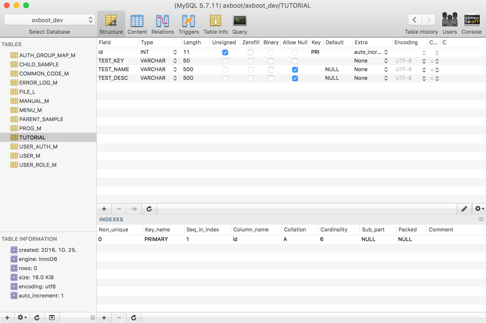
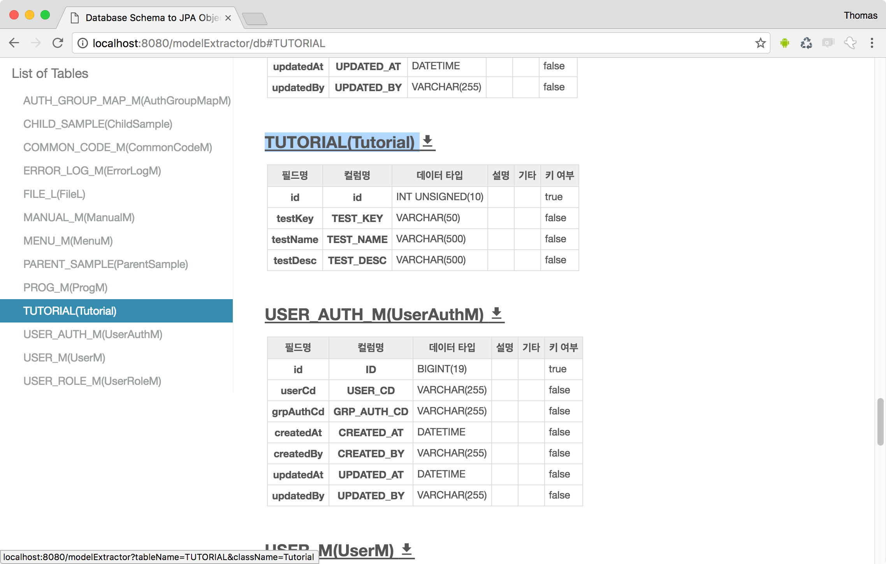
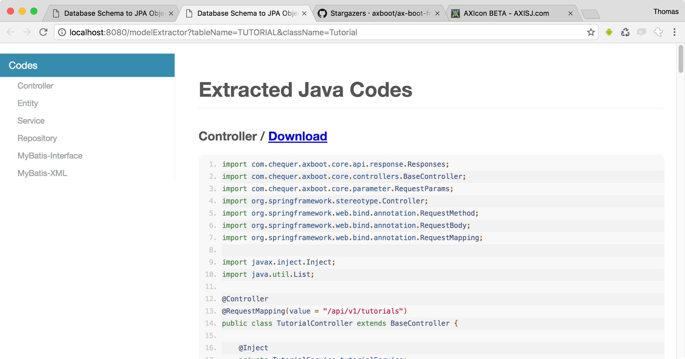
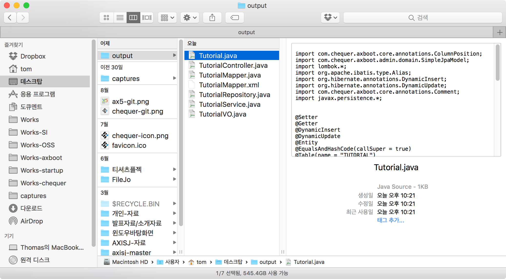
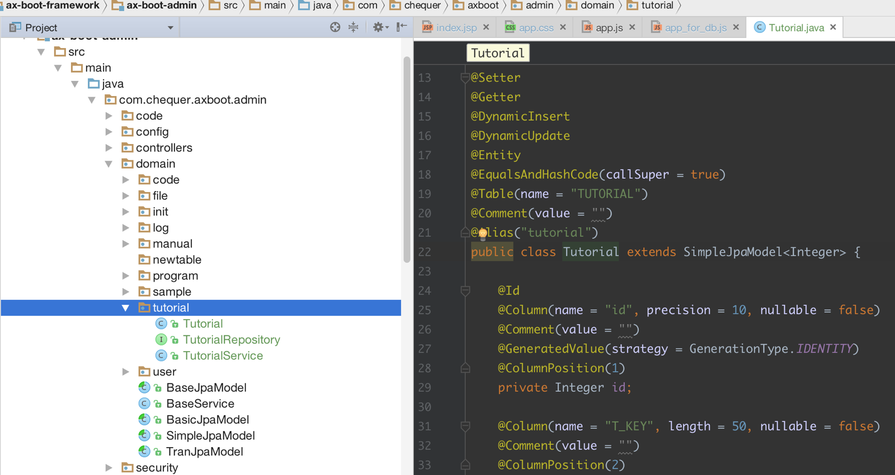
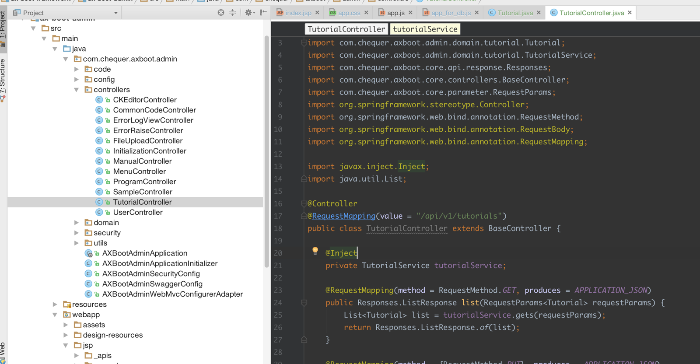
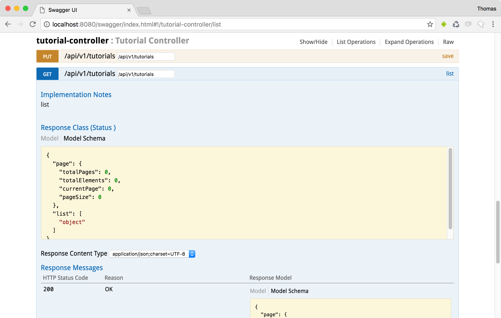
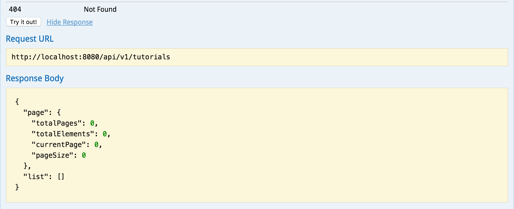

# modelExtractor 를 이용한 JPA API 만들기

1. 데이터베이스에 Table을 생성한다.(BaseJPAModel)을 쓰는 경우 CREATED_BY, CREATED_AT, UPDATED_AT, UPDATED_BY 필드가 필수, (SimpleJPAModel)을 쓰는 경우엔 key, value, sort같은 예약어를 제외하면 제약이 없다.


2. http://localhost:8080/modelExtractor/db 접속합니다. 
생성한 테이블 TUTORIAL을 찾아. 테이블 명을 클릭합니다.




3. 바탕화면 > output 폴더안에 다운로드된 파일들을 프로젝트의 폴더에 붙여넣기
  
  - `Tutorial.java, TutorialRepository.java, TutorialService.java` 파일들을 
`ax-boot-admin/src/main/java/com/chequer/axboot/admin/domain` 하위에 원하는 패키지명으로 패키지 생성후(예제에서는 tutorial 로 생성)


  - `TutorialController.java` 파일을 `ax-boot-admin/src/main/java/com/chequer/axboot/admin/controllers` 하위에 파일을 붙여넣기 합니다.  컨트롤러 클래스를 열고 서비스와 엔티티를 임포트 합니다.
  - 도메인 패키지에 해당하는 메이븐 clean, complie을 하세요.
  - 서버를 재시작합니다.

4. http://localhost:8080/swagger/index.html#!/tutorial-controller/list 에 접속 합니다.  `Try it out`버튼을 클릭하면 GET API의 결과를 미리볼 수 있습니다.  
5. [PUT] /api/v1/tutorials 에 다음의 JSON을 입력하고 `Try it out` 버튼을 클릭합니다.
```json
{
  "testKey": "TEST",
  "testName": "TEST NAME",
  "testDesc": "....."
}
```
그런다음 GET API를 호출하면 다음의 JSON을 받을 수 있습니다.
```json
{
  "page": {
    "totalPages": 0,
    "totalElements": 0,
    "currentPage": 0,
    "pageSize": 0
  },
  "list": [
    {
      "id": 7,
      "testKey": "TEST",
      "testName": "TEST NAME",
      "testDesc": ".....",
      "dataStatus": "ORIGIN",
      "__deleted__": false,
      "__created__": false,
      "__modified__": false
    }
  ]
}
```


