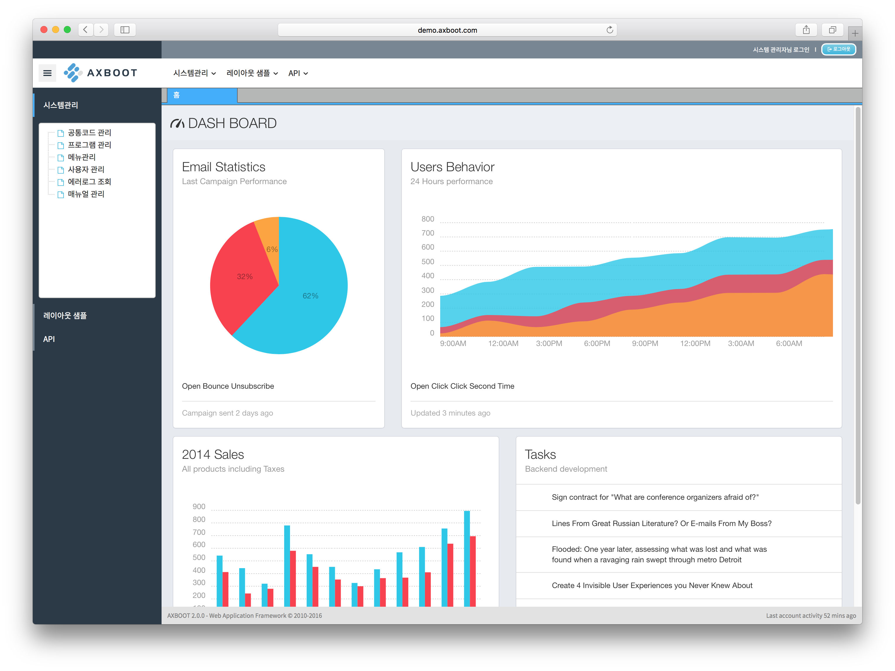
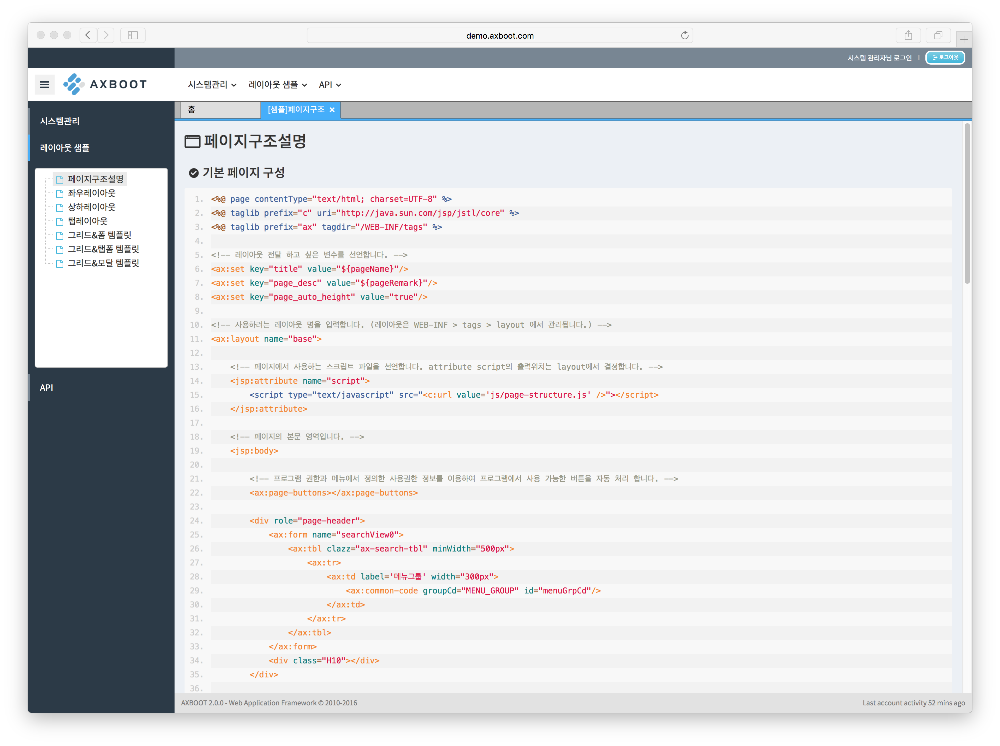
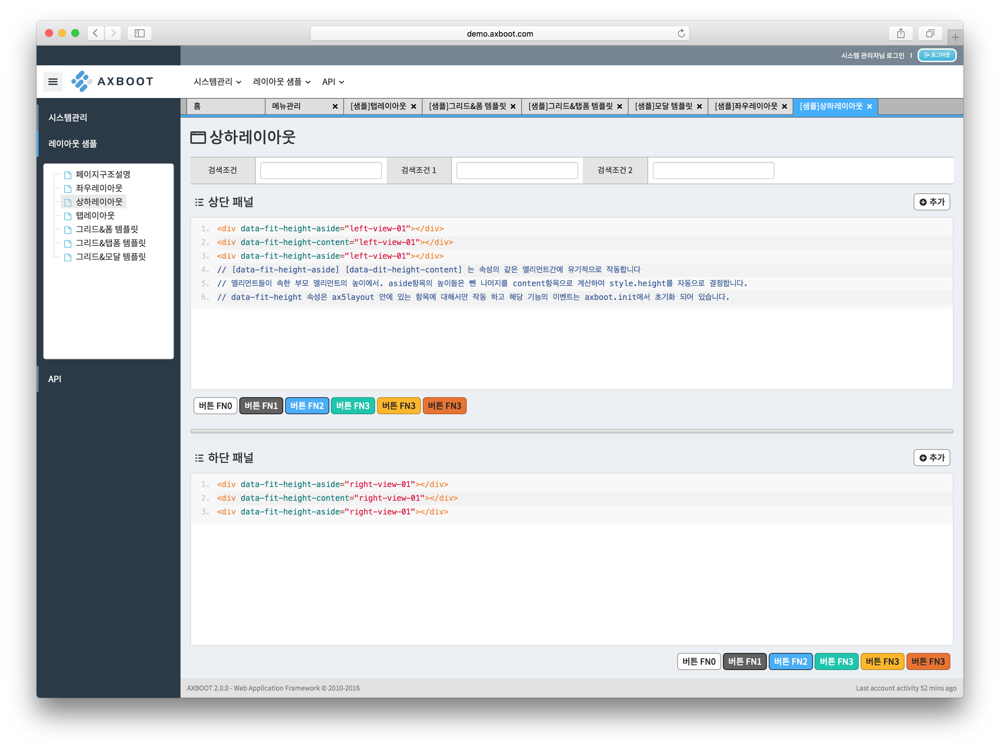
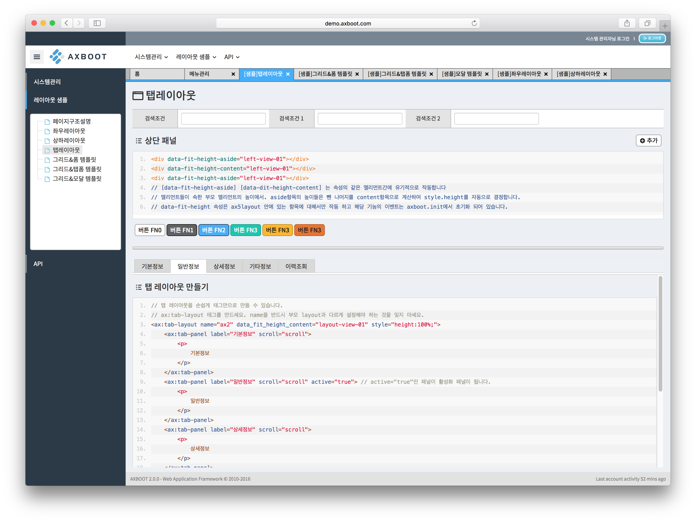
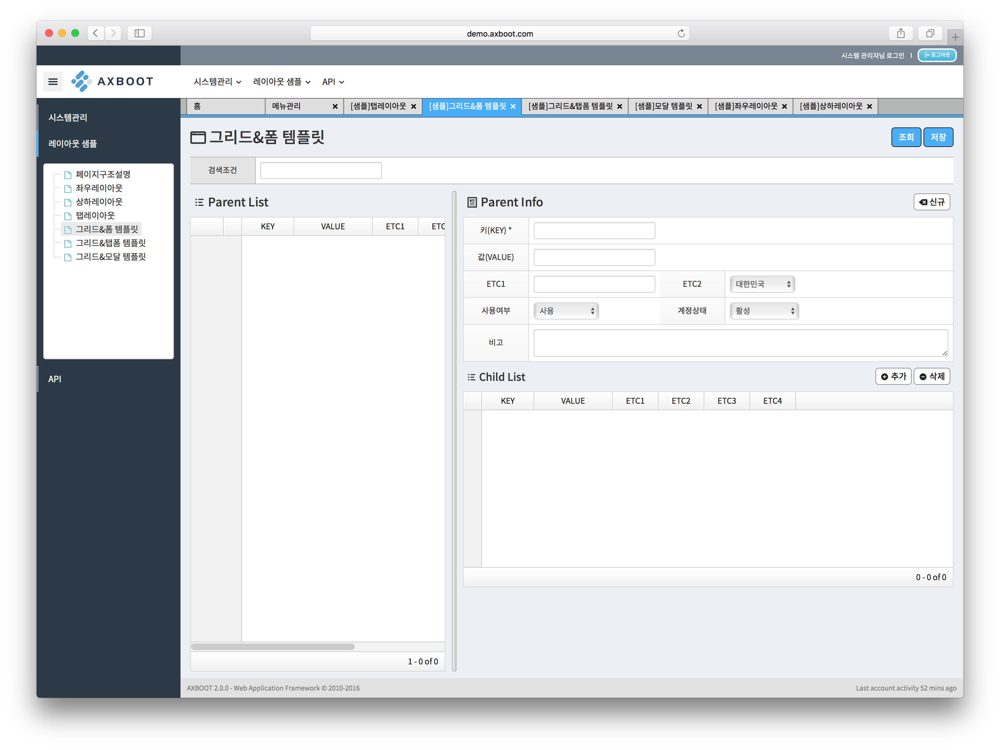
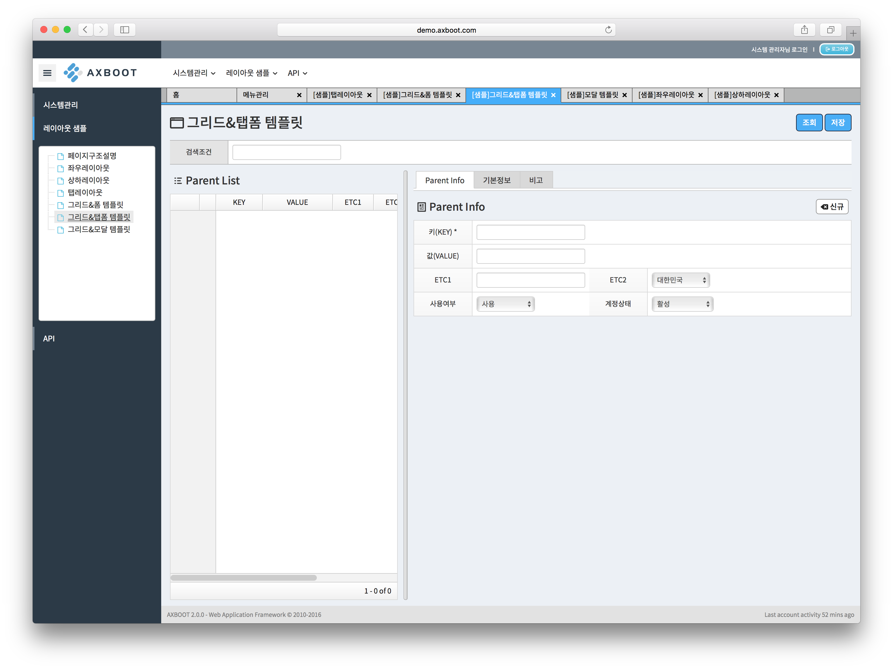
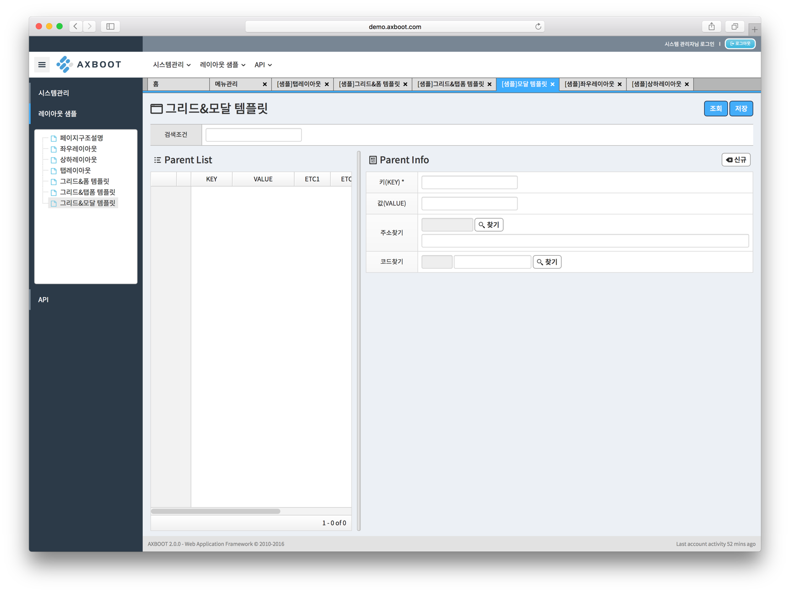

## 로그인 페이지, 대시보드, 샘플 페이지 제공 

- AXBoot는 업무화면을 보다 쉽고 간단하게 구현할 수 있도록 레이아웃 시스템과 태그 라이브러리, 샘플 페이지를 제공합니다.

- 로그인 페이지

>axboot.json의 `logo -> login`와 `background -> login` 이미지 경로를 설정하면 로그인 페이지 로고와 배경화면을 변경할 수 있습니다.

- 대시보드 

>[chartist.js](https://gionkunz.github.io/chartist-js/)를 사용한 샘플 대시보드를 제공합니다. 

- 업무처리 페이지

- 샘플 페이지 (페이지구조설명)

>AXBoot 기본 페이지 구성을 설명합니다.

- 샘플 페이지 (좌우레이아웃)

>좌우로 구성된 레이아웃 샘플 페이지입니다.

- 샘플 페이지 (상하레이아웃)

>상하로 구성된 레이아웃 샘플 페이지입니다.

- 샘플 페이지 (탭레이아웃)

>탭 레이아웃이 구성된 샘플 페이지입니다.

- 샘플 페이지 (그리드 & 폼)

>그리드와 폼으로 구성된 샘플 페이지입니다.

- 샘플 페이지 (그리드 & 탭 폼)

>그리드와 탭 폼으로 구성된 샘플 페이지입니다.

- 샘플 페이지 (그리드 & 모달)

>그리드와 모달로 구성된 샘플 페이지입니다.

