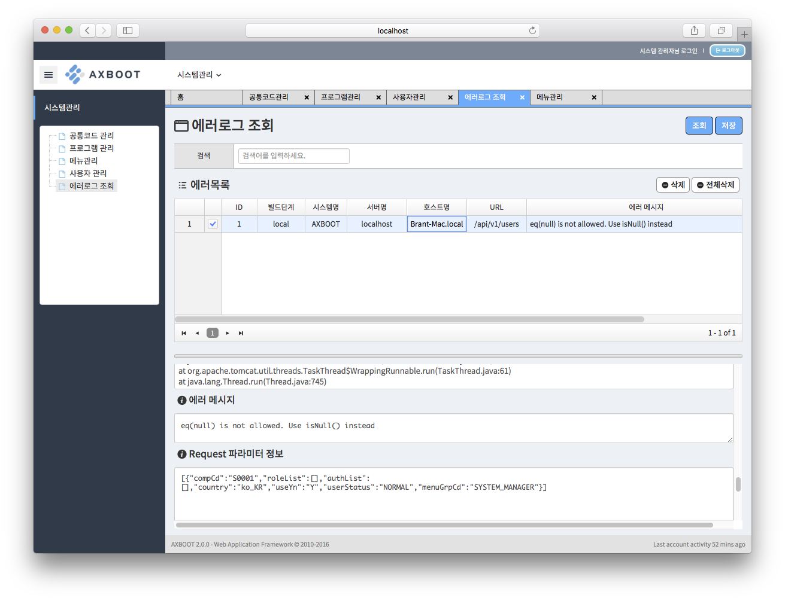

## 로깅 시스템

- AXBoot는 데이터 처리도 중 에러가 발생하면, 다음과 같은 정보를 포함하여 에러로그를 기록하고, 설정에 따라 이메일, SMS, 메신저 등으로 알람을 발송할 수 있습니다.
    - 서비스 단계 (개발, 알파, 베타, 운영)
    - 시스템 명 (서비스 구동시 임의로 지정 가능)
    - 로거 명 (해당 에러를 기록한 로거 이름)
    - 서버 명 (기본값 : IP or Host)
    - HTTP 요청 경로
    - 에러 메시지
    - StackTrace
    - 에러시간
    - HTTP 요청 헤더 정보
    - HTTP 요청 파라미터 정보
    - 사용자 정보
- 또한 에러로그조회 페이지에서 에러를 조회 및 검색 할 수 있습니다.
