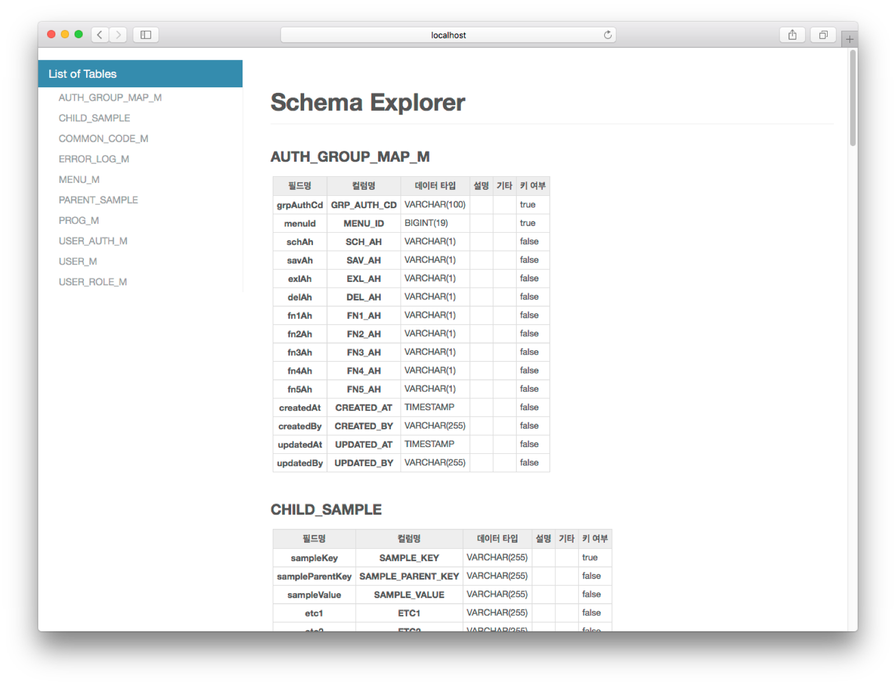
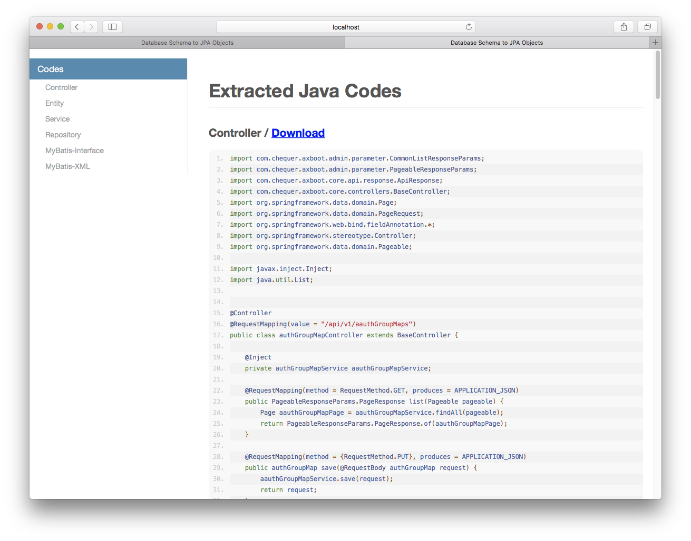

## 스키마 추출 도구

- AXBoot는 데이터베이스 테이블 정보를 기반으로 Controller, Service, Repository, Entity, MyBatis XML를 자동으로 생성해주는 기능을 제공합니다.
- http://{host}:{port}/modelExtractor/db로 접속하면, 다음과 같이 데이터베이스의 모든 테이블이 왼쪽에 표시됩니다.

- 해당 테이블의 이름을 선택하면 다음과 같이 코드가 자동생성되어 표시되고, 바탕화면 output 디렉토리에 Java, XML 파일이 생성됩니다.

- 생성된 파일들을 Controller, Domain 패키지에 복사하기만 하면 CRUD와 페이징, 검색 등의 기능이 포함된 코드를 기반으로 구현을 시작할 수 있습니다.