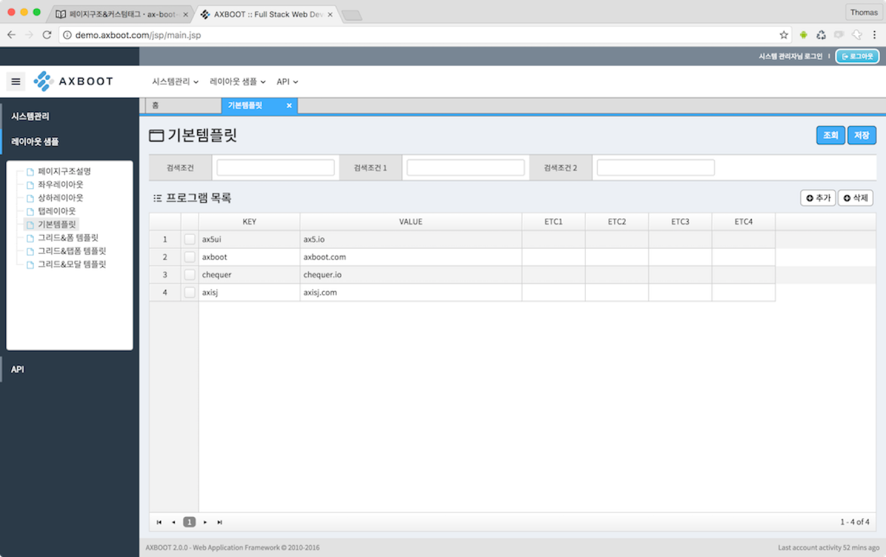
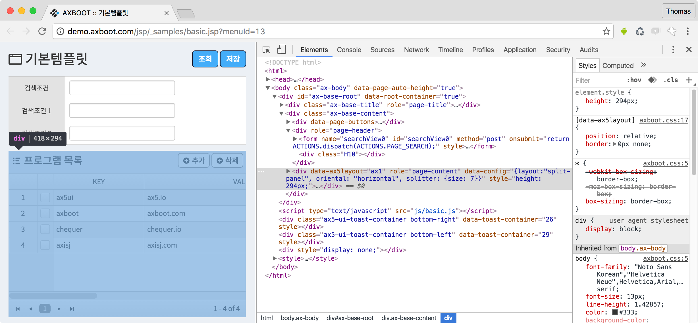

# 기본템플릿

> 기본 템플릿은 demo.axboot.com 접속 후 `레이아웃 샘플 > 기본템플릿` 메뉴를 선택하시면 확인 할 수 있습니다. 기본 템플릿은 검색바와 인라인 에디트를 지원하는 그리드를 기본 구성으로 하는 샘플 페이지 입니다.
> API 로는 `/api/v1/samples/parent` [GET][PUT] 을 사용합니다.



## VIEW
```html
<%@ page contentType="text/html; charset=UTF-8" %>
<%@ taglib prefix="c" uri="http://java.sun.com/jsp/jstl/core" %>
<%@ taglib prefix="ax" tagdir="/WEB-INF/tags" %>

<ax:set key="title" value="${pageName}"/>
<ax:set key="page_desc" value="${PAGE_REMARK}"/>
<ax:set key="page_auto_height" value="true"/>
```
페이지의 선언 구문 입니다. 레이아웃 (`WEB-INF/tags/layout/base.tag`) 파일에 전달된 변수를 `ax:set`으로 정의 합니다.
각각의 프로그램 페이지는 시스템에서 설정한 메뉴이름을 session변수로 가지고 있습니다. 세션변수로 전달된 값들은 `${pageName}`으로 jstl 에서 사용 할 수 있습니다.

```html
<ax:layout name="base">
    <jsp:attribute name="script">
        <script type="text/javascript" src="<c:url value='js/basic.js' />"></script>
    </jsp:attribute>
```
페이지에서 사용 할 JS파일을 지정 합니다. `jsp:attribute`는 script뿐 아니라 레이아웃에서 정의한 키 값이면 모두 사용 할 수 있습니다.
단. AXBOOT에서는 `jsp:body`가 항상 가장 마지막 요소 이어야 하므로 `jsp:attribute`를 먼저 선언 후 `jsp:body`를 마지막에 두어야 합니다.  

`basic.js` 와 같은 프로그램 JS 파일은 레이아웃에 선언된 `axboot.js`에 의해 `fnObj.pageStart`함수가 실행됩니다. 또한 내부에 ACTION & VIEW 패턴으로 코딩 되어 있습니다.
ACTION & VIEW 패턴에 대해서는 이 장의 아래에서 다루겠습니다.

```html
    <jsp:body>
        <ax:page-buttons></ax:page-buttons>
```
프로그램과 메뉴가 가진 권한에 따라 페이지의 버튼을 출력 시켜주는 커스텀 태그 입니다. `WEB-INF/tags/page-buttons.tag` 에서 확인 할 수 있습니다.
원하는 경우 권한을 확장, 또는 커스트 마이징을 할 수 있습니다.

```html
        <div role="page-header">
            <ax:form name="searchView0">
                <ax:tbl clazz="ax-search-tbl" minWidth="500px">
                    <ax:tr>
                        <ax:td label='검색조건' width="300px">
                            <input type="text" class="form-control" />
                        </ax:td>
                        <ax:td label='검색조건 1' width="300px">
                            <input type="text" class="form-control" />
                        </ax:td>
                        <ax:td label='검색조건 2' width="300px">
                            <input type="text" class="form-control" />
                        </ax:td>
                    </ax:tr>
                </ax:tbl>
            </ax:form>
            <div class="H10"></div>
        </div>
```
프로그램 페이지는 `role="page-header"`, `role="page-content"` 로 나누어 집니다.
페이지가 시작할 때, 리사이즈 될 때 마다 브라우저의 높이에 맞게 화면을 출력하기 위해 `page-header`를 뺀 나머지 영역을 계산하여 `page-content`의 높이로 자동 계산합니다.



높이 자동 계산에 대한 스크립트는 `axboot.js`에서 처리 하고 있습니다.

```html
        <ax:split-layout name="ax1" oriental="horizontal">
            <ax:split-panel width="*" style="">

                <!-- 목록 -->
                <div class="ax-button-group" data-fit-height-aside="grid-view-01">
                    <div class="left">
                        <h2><i class="cqc-list"></i>
                            프로그램 목록 </h2>
                    </div>
                    <div class="right">
                        <button type="button" class="btn btn-default" data-grid-view-01-btn="add"><i class="cqc-circle-with-plus"></i> 추가</button>
                        <button type="button" class="btn btn-default" data-grid-view-01-btn="delete"><i class="cqc-circle-with-plus"></i> 삭제</button>
                    </div>
                </div>
                <div data-ax5grid="grid-view-01" data-fit-height-content="grid-view-01" style="height: 300px;"></div>

            </ax:split-panel>
        </ax:split-layout>
```
ax:split-layout 는 `WEB-INF/tags` 에서 커스텀 태그 처리 구문을 확인 할 수 있습니다. 
커스텀 태그 안에서 `role="page-content"` 속성을 만들어 주고 있어,
split-layout만 코딩했지만 페이지 높이가 최적화된 화면을 볼 수 있습니다.

레이아웃은 vertical, horizontal 이 있으면 중첩하여 사용 할 수 있습니다. (단, name 값을 한 화면에서 고유 하게 입력 되어야 합니다.)

**split-panel**

split-panel안에있는 태그의 속성이 data-fit-height-aside, data-fit-height-content를 가진다면 패널의 높이 안에서 aside엘리먼트들의 높이를 제외한 나머지 공간을 content가 가지게 됩니다.
```html
    </jsp:body>
</ax:layout>
```


## JS

```js
var fnObj = {};
```
프로그램 페이지에서 사용하는 변수 입니다. AXBOOT에서는 가급적 글로벌 변수 선언을 제한하는 것을 권장하고 있습니다.
하나의 프로그램 페이지에는 `ACTIONS`, `fnObj`, `ax5`, `axboot` 등 몇가지를 몇가지 변수만 사용하고 있습니다.

```js
var ACTIONS = axboot.actionExtend(fnObj, {
    PAGE_SEARCH: function(){
        axboot.ajax({
            type: "GET",
            url: "/api/v1/samples/parent",
            data: caller.searchView.getData(),
            callback: function (res) {
                caller.gridView01.setData(res);
            }
        });
        return false;        
    },
    dispatch: function(){
        var result = ACTIONS.exec(caller, act, data);
        if (result != "error") {
            return result;
        } else {
            // 직접코딩
            return false;
        }
    } 
});
```
ACTIONS 오브젝트는 `axboot > src > view-action.js` 에서 actionExtend 함수를 이용하여 구현됩니다.
ACTIONS 내부의 키들(액션명)을 내장된 dispatch 함수가 사용자가 선언한 dispatch 함수를 실행해줍니다.
사용자의 dispatch 안에서 `ACTIONS.exec`실행하면 액션명으로 정의된 함수를 실행 해줍니다.

ACBOOT의 JS파일은 VIEW들과 ACTIONS 간에 통신을 하여 비즈니스 로직을 처리합니다. 
각 VIEW들은 내부에서 처리할 로직을 처리하고 외부와의 통신(AJAX, 다른뷰로 요청, 응답등)은 ACTIONS에서 처리합니다.

이런 방식으로 코딩 하면, 뷰와 뷰 사이에 의존성을 제거 하게 되므로 좀 더 유연한 코딩이 가능합니다. 또한 개발자간에 인수 인계 작업도 수월해져 유지보수가 용이합니다.

```js
// fnObj 기본 함수 스타트와 리사이즈
fnObj.pageStart = function () {
    this.pageButtonView.initView();
    this.searchView.initView();
    this.gridView01.initView();

    ACTIONS.dispatch(ACTIONS.PAGE_SEARCH);
};

fnObj.pageResize = function () {

};
```

```js
fnObj.pageButtonView = axboot.viewExtend({
    initView: function () {
        var _this = this;
        $('[data-page-btn]').click(function () {
            _this.onClick(this.getAttribute("data-page-btn"));
        });
    },
    onClick: function (_act) {
        var _root = fnObj;
        switch (_act) {
            case "search":
                ACTIONS.dispatch(ACTIONS.PAGE_SEARCH);
                break;
            case "save":
                ACTIONS.dispatch(ACTIONS.PAGE_SAVE);
                break;
            case "excel":
                break;
            case "fn1":
                break;
            case "fn2":
                break;
            case "fn3":
                break;
            case "fn4":
                break;
            case "fn5":
                break;
        }
    }
});
```


```js
/**
 * gridView
 */
fnObj.gridView01 = axboot.viewExtend(axboot.gridView, {
    initView: function () {
        var _this = this;

        this.target = axboot.gridBuilder({
            showRowSelector: true,
            frozenColumnIndex: 0,
            multipleSelect: true,
            target: $('[data-ax5grid="grid-view-01"]'),
            columns: [
                {key: "key", label: "KEY", width: 160, align: "left", editor: "text"},
                {key: "value", label: "VALUE", width: 350, align: "left", editor: "text"},
                {key: "etc1", label: "ETC1", width: 100, align: "center", editor: "text"},
                {key: "ect2", label: "ETC2", width: 100, align: "center", editor: "text"},
                {key: "ect3", label: "ETC3", width: 100, align: "center", editor: "text"},
                {key: "ect4", label: "ETC4", width: 100, align: "center", editor: "text"}
            ],
            body: {
                onClick: function () {
                    this.self.select(this.dindex);
                }
            }
        });
        

        $('[data-grid-view-01-btn]').click(function () {
            var _act = this.getAttribute("data-grid-view-01-btn");
            switch (_act) {
                case "add":
                    ACTIONS.dispatch(ACTIONS.ITEM_ADD);
                    break;
                case "delete":
                    ACTIONS.dispatch(ACTIONS.ITEM_DEL);
                    break;
            }
        });
    }
});
```