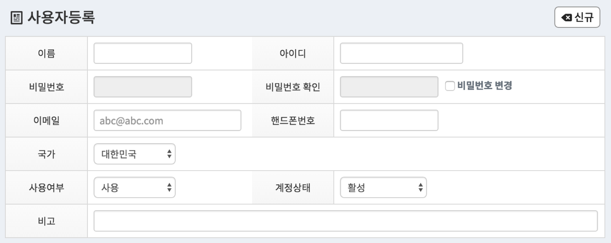

# 페이지 구조설명


## ax:tbl, ax:tr, ax:td
```html
<ax:form name="formView01">
    <input type="hidden" name="hiddenValue" value=""/>
    <ax:tbl clazz="ax-form-tbl" minWidth="500px">
        <ax:tr>
            <ax:td label="이름" width="300px">
                <input type="text" name="userNm" data-ax-path="userNm" maxlength="15" title="이름" class="av-required form-control W120" value=""/>
            </ax:td>
            <ax:td label="아이디" width="220px">
                <input type="text" name="userCd" data-ax-path="userCd" maxlength="100" title="아이디" class="av-required form-control W150" value=""/>
            </ax:td>
        </ax:tr>
        <ax:tr>
            <ax:td label="내용" width="100%">
                <input type="password" name="userPs" data-ax-path="userPs" maxlength="128" class="form-control W120" value="" readonly="readonly"/>
            </ax:td>
        </ax:tr>
    </ax:tbl>
</ax:form>
```

**ax:table 출력결과 예**

