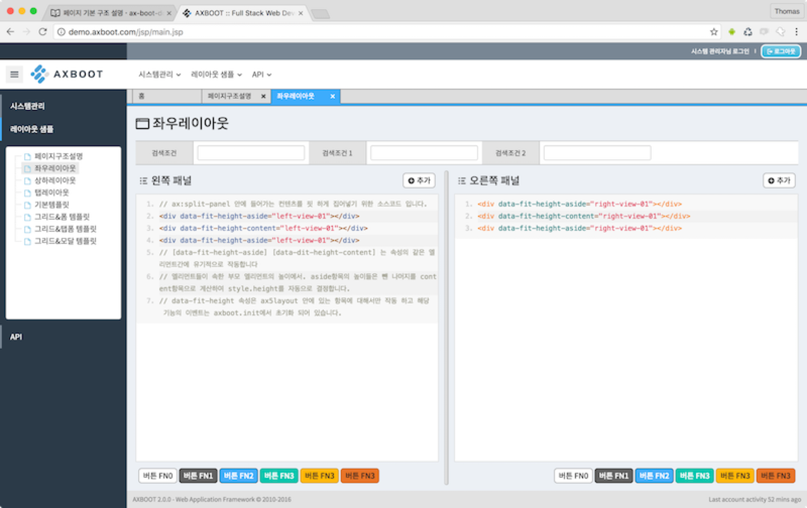
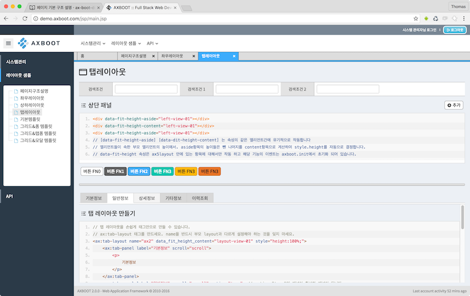

# 페이지 구조설명 & 커스텀 태그

## 기본 페이지 구성

```html
<%@ page contentType="text/html; charset=UTF-8" %>
<%@ taglib prefix="c" uri="http://java.sun.com/jsp/jstl/core" %>
<%@ taglib prefix="ax" tagdir="/WEB-INF/tags" %>
 
<!-- 레이아웃 전달 하고 싶은 변수를 선언합니다. -->
<ax:set key="title" value="${pageName}"/>
<ax:set key="page_desc" value="${PAGE_REMARK}"/>
<ax:set key="page_auto_height" value="true"/>
 
<!-- 사용하려는 레이아웃 명을 입력합니다. (레이아웃은 WEB-INF > tags > layout 에서 관리됩니다.) -->
<ax:layout name="base">
 
    <!-- 페이지에서 사용하는 스크립트 파일을 선언합니다. attribute script의 출력위치는 layout에서 결정합니다. -->
    <jsp:attribute name="script">
        <script type="text/javascript" src="<c:url value='js/page-structure.js' />"></script>
    </jsp:attribute>
 
    <!-- 페이지의 본문 영역입니다. -->
    <jsp:body>
 
        <!-- 프로그램 권한과 메뉴에서 정의한 사용권한 정보를 이용하여 프로그램에서 사용 가능한 버튼을 자동 처리 합니다. -->
        <ax:page-buttons></ax:page-buttons>
 
        <div role="page-header">
            <ax:form name="searchView0">
                <ax:tbl clazz="ax-search-tbl" minWidth="500px">
                    <ax:tr>
                        <ax:td label='메뉴그룹' width="300px">
                            <ax:common-code groupCd="MENU_GROUP" id="menuGrpCd"/>
                        </ax:td>
                    </ax:tr>
                </ax:tbl>
            </ax:form>
            <div class="H10"></div>
        </div>
 
        <!-- role="page-header" 높이를 뺀 나머지 높이를 role="page-content" 가 차지하게 됩니다 -->
        <div role="page-content">
 
        </div>
 
    </jsp:body>
</ax:layout>
```

## ax커스텀 태그
AXBOOT JSP페이지는 JSTL2.0 스펙을 이용한 커스텀태그를 지원합니다.
커스텀 태그는 WEB-INF > tags 아래에 *.tag 파일들로 원하는 태그를 직접 만들어 사용할 수 있습니다.
AXBOOT에서는 웹 애플리케이션 개발에 필요한 커스텀 태그를 미리 만들어 제공하고 있습니다. AXBOOT의 커스텀 태그를 이용하여 개발에 날개를 달아보세요. 다음은 몇가지 커스텀 태그 샘플을 소개 하겠습니다.

## ax:tbl, ax:tr, ax:td
```html
<ax:form name="formView01">
    <input type="hidden" name="hiddenValue" value=""/>
    <ax:tbl clazz="ax-form-tbl" minWidth="500px">
        <ax:tr>
            <ax:td label="이름" width="300px">
                <input type="text" name="userNm" data-ax-path="userNm" maxlength="15" title="이름" class="av-required form-control W120" value=""/>
            </ax:td>
            <ax:td label="아이디" width="220px">
                <input type="text" name="userCd" data-ax-path="userCd" maxlength="100" title="아이디" class="av-required form-control W150" value=""/>
            </ax:td>
        </ax:tr>
        <ax:tr>
            <ax:td label="내용" width="100%">
                <input type="password" name="userPs" data-ax-path="userPs" maxlength="128" class="form-control W120" value="" readonly="readonly"/>
            </ax:td>
        </ax:tr>
    </ax:tbl>
</ax:form>
```
**ax:table 출력결과 예**


> 태그의 랜더링 되는 내용은 WEB-INF아래의 파일을 직접열어서 구조를 파악하고 퍼블리싱하는게 중요합니다. 구조를 이해하고 확장해 나가면 유연하면서도 빠른 퍼블리싱이 가능합니다.
 ax:table은 반응형 테이블 퍼블리싱을 지원합니다. ax:td의 width는 라벨을 포함한 너비값이 되고 라벨의 너비를 조정해야 할 때엔 labelWidth 속성을 부여해야 합니다. 라벨의 너비는 ax:table이 사용하는 CSS클래스에 정의되어 있으며 [data-ax-tbl] 으로 찾을 수 있습니다.
 
> 반드시 ax:form은 ax:table의 부모일 필요가 없습니다 각각 독립적으로 작용하고 필요에 따라 표준 form 태그를 사용할 수 있습니다.

## ax:split-layout, ax:split-panel

```html
<ax:split-layout name="ax1" oriental="vertical">
    <ax:split-panel width="300" style="padding-right: 10px;">
        너비가 300인 왼쪽 패널
    </ax:split-panel>
    <!-- splitter -->
    <ax:splitter></ax:splitter>
    <ax:split-panel width="*" style="padding-left: 10px;" id="split-panel-form" scroll="true">
        너비가 나머지인 오른쪽 패널 (건텐츠의 높이가 넘칠 경우 스크롤)
    </ax:split-panel>
</ax:split-layout>
<ax:split-layout name="ax1" oriental="horizontal">
    <ax:split-panel height="300" style="padding-bottom: 10px;">
        높이가 300인 상단 패널
    </ax:split-panel>
    <!-- splitter -->
    <ax:splitter></ax:splitter>
    <ax:split-panel height="*" style="padding-top: 10px;" id="split-panel-form" scroll="true">
        높이가 나머지인 하단 패널 (건텐츠의 높이가 넘칠 경우 스크롤)
    </ax:split-panel>
</ax:split-layout>
```

> 리사이즈가 가능한 레이아웃 시스템을 사용할 수 있습니다. 좌우/상하 레이아웃이 구현된 샘플은 [좌우레이아웃][상하레이아웃] 을 확인하세요.

## ax:tab-layout

```html
<ax:tab-layout name="ax2" data_fit_height_content="layout-view-01" style="height:100%;">
    <ax:tab-panel label="기본정보" scroll="scroll">
        <p>
            기본정보
        </p>
    </ax:tab-panel>
    <ax:tab-panel label="일반정보" scroll="scroll" active="true">
    	<p>
            일반정보
        </p>
    </ax:tab-panel>
</ax:tab-layout>
```



> 페이지의 컨텐츠를 탭으로 분리하여 표현하고 싶을 때 사용하는 레이아웃 입니다. AXBOOT로는 간단하게 태그만으로 탭 레이아웃을 사용할 수 있습니다.