# 설치 및 실행방법

## 준비
- Java
    - http://www.oracle.com/technetwork/java/javase/downloads/index.html에 방문하여 Oracle JDK 1.8.0 이상을 설치합니다.

- Tomcat
    - http://tomcat.apache.org 에 방문하여 Tomcat 7.0 버전 이상을 설치합니다.

- Eclipse
    - IDE로 Eclipse를 사용할 경우, http://www.eclipse.org에 방문하여 Luna 이상의 버전(최신버전 권장)을 설치합니다.

- STS(Spring Tool Suite)
    - IDE로 STS를 사용할 경우 https://spring.io/tools에 방문하여 3.7.0 이상 (최신버전 권장)을 설치합니다.

- IntelliJ
    - IDE로 IntelliJ를 사용할 경우 12버전 이상의 Ultimate 버전 (최신버전 권장)을 설치합니다.

- Lombok
    - Eclipse를 사용할 경우 https://projectlombok.org에 방문하여 lombok.jar를 통해 Eclipse에 Lombok 플러그인을 설치합니다.
    - IntelliJ를 사용할 경우 Lombok Plugin을 설치합니다.
    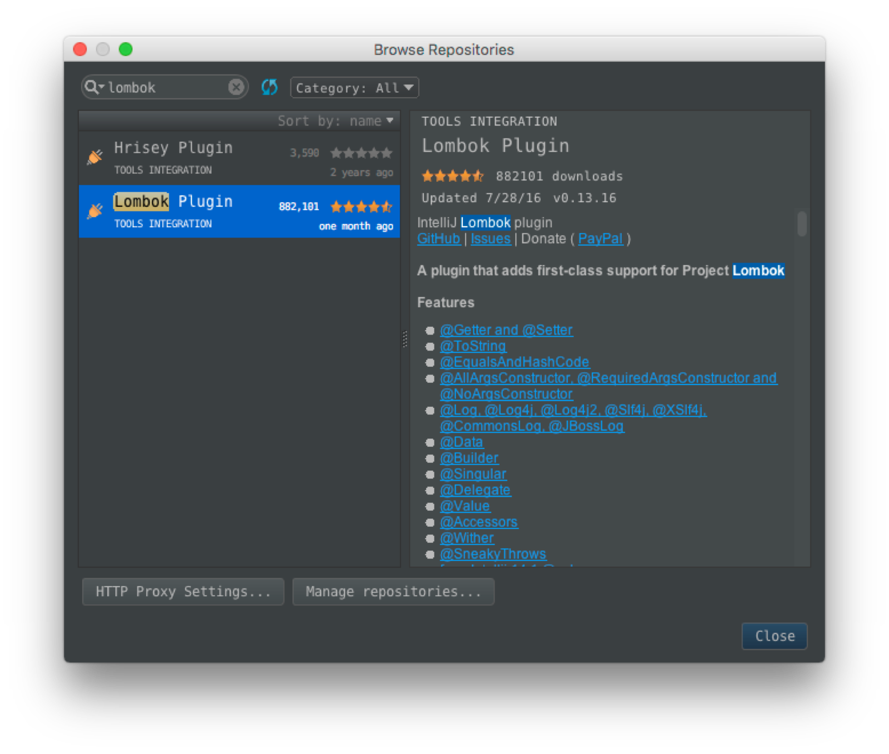

- Git
    - https://git-scm.com에 방문하여 Git을 설치합니다.

## 소스코드 생성하기
1. AXBoot Start에 접속합니다. http://start.axboot.com 
2. Maven Group ID, Artifact ID, 프로젝트 명과 프로젝트에 대한 간단한 설명, 마지막으로 소스코드 패키지 명을 입력한 후, 소스코드 생성 버튼을 클릭합니다.
3. 다운로드된 압축 파일을 해제한 다음, 

## 소스코드 열기 (Eclipse / STS)
1. File -> Import -> Maven -> Existing Maven Projects를 선택합니다.
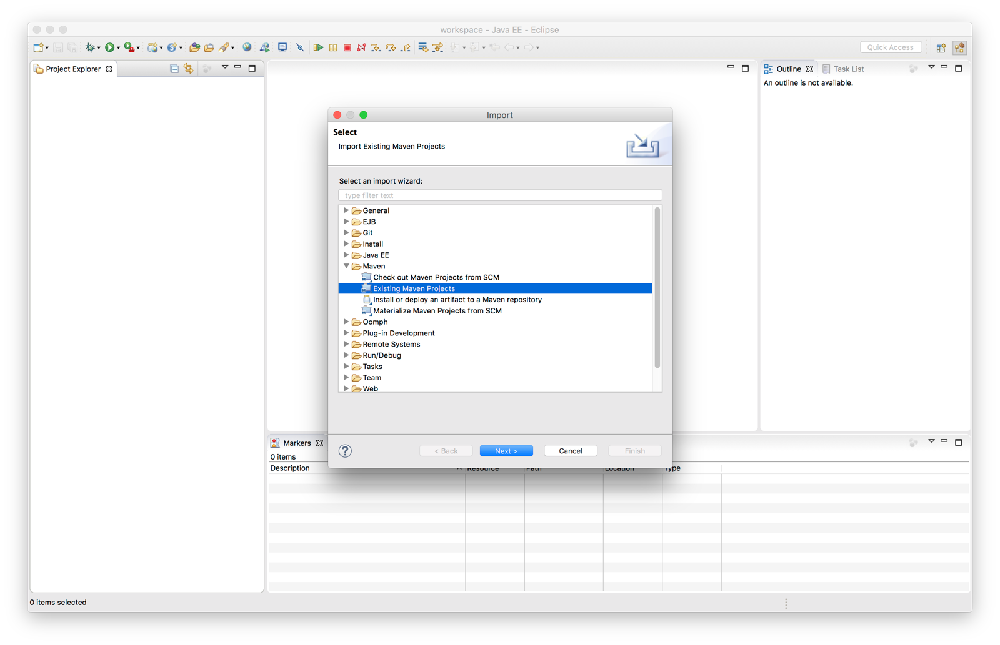
2. Git을 통해 내려받은 AXBoot 소스코드를 선택하고 Finish 버튼을 클릭합니다.
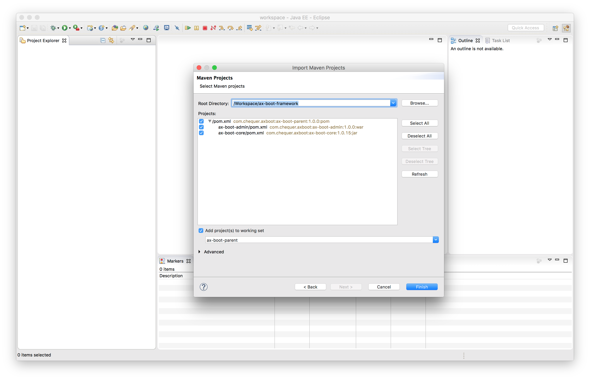

## 소스코드 열기 (IntelliJ)
1. 시작화면에서 Open을 선택하고 Git을 통해 내려받은 AXBoot 소스코드를 선택합니다.

## AXBoot 실행하기(Spring Boot 내장 톰캣 사용)
1. mvn spring-boot:run 명령을 터미널에서 입력합니다.

## AXBoot 실행하기(외부 톰캣 사용) - Eclipse / STS
1. File -> New -> Other -> Server -> Server를 선택후 Next 버튼을 클릭합니다.
2. Apache -> Tomcat (설치한버전)을 선택합니다.
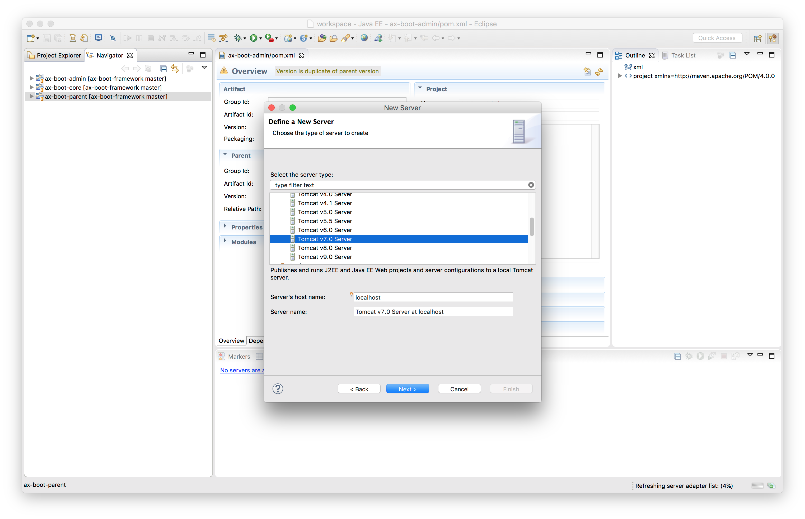
3. 톰캣이 설치된 디렉토리와 JRE를 선택하고 Finish를 클릭합니다.
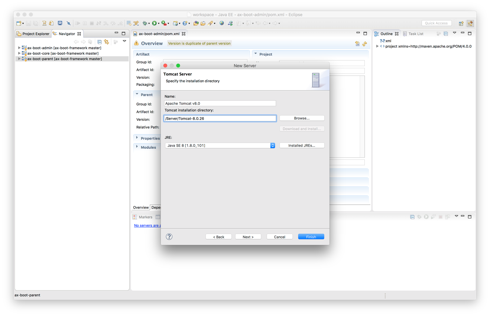
4. Navigator에 있는 ax-boot-admin 프로젝트에서 마우스 우측버튼을 클릭한 후 Properties를 클릭합니다
5. Web Project Settings를 선택 후 Context root에 /를 입력 후 OK를 클릭합니다.
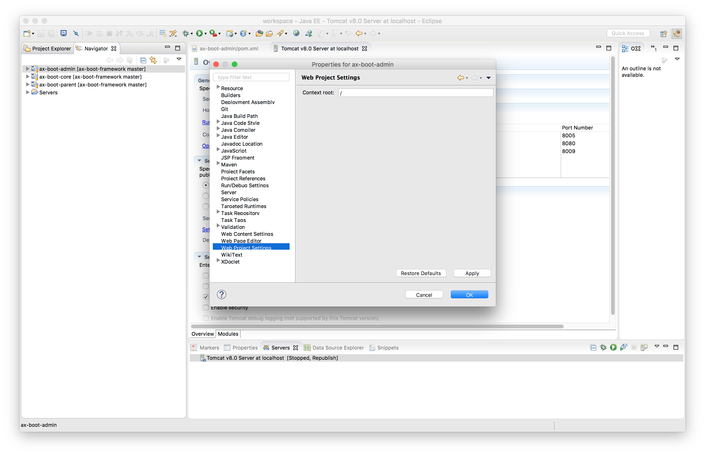
6. Servers 탭에 추가한 서버를 더블클릭 한 후, Modules 탭으로 이동합니다.
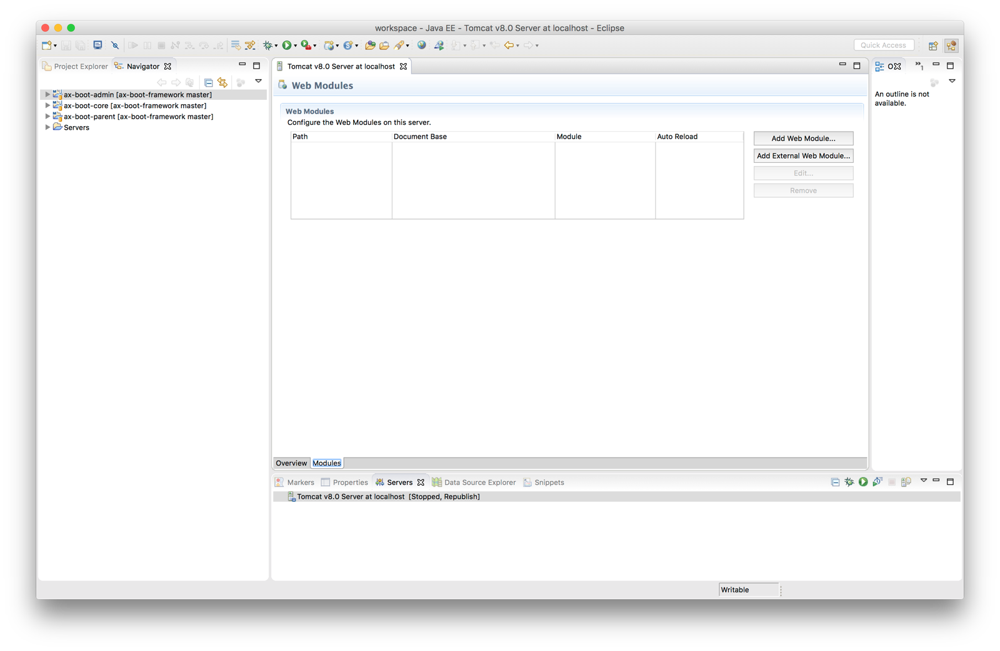
7. Add Web Module 버튼을 클릭 한 후 다음과 같은 화면이 나온면 OK를 클릭합니다.
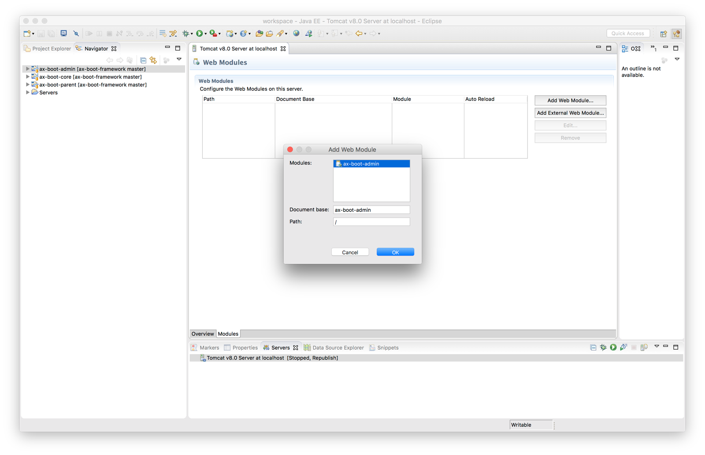
8. 서버에서 마우스 우측 버튼을 클릭한 후 서버를 시작합니다.
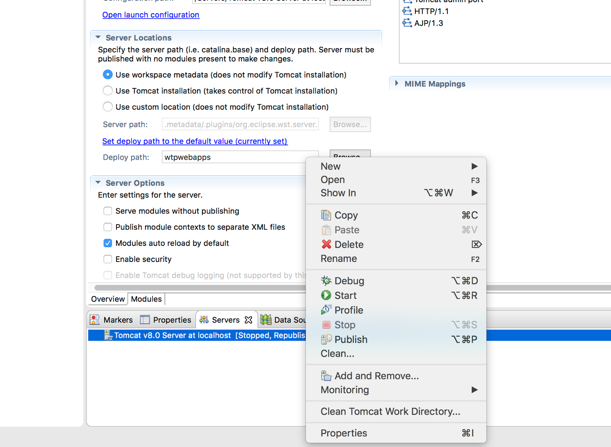

## AXBoot 실행하기(외부 톰캣 사용) - IntelliJ
1. Run -> Edit Configuration을 선택합니다.
2. + 을 클릭 한 후 Tomcat Server -> Local을 선택합니다.
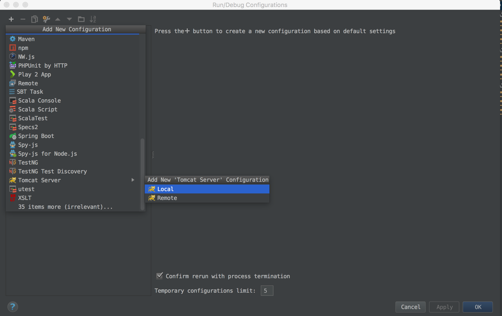
3. Name에 적당한 이름을 입력한 후, Deployment 탭에서 + 버튼을 눌러 Artifact를 선택합니다.
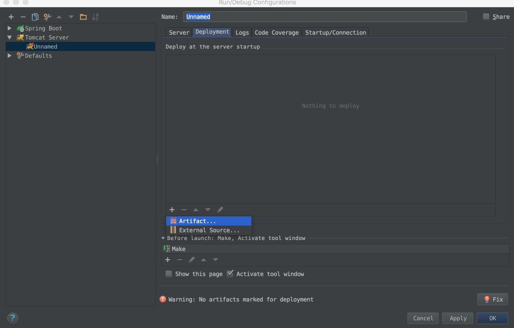
4. ax-bot-admin:war exploded를 선택한 후 OK를 클릭합니다.
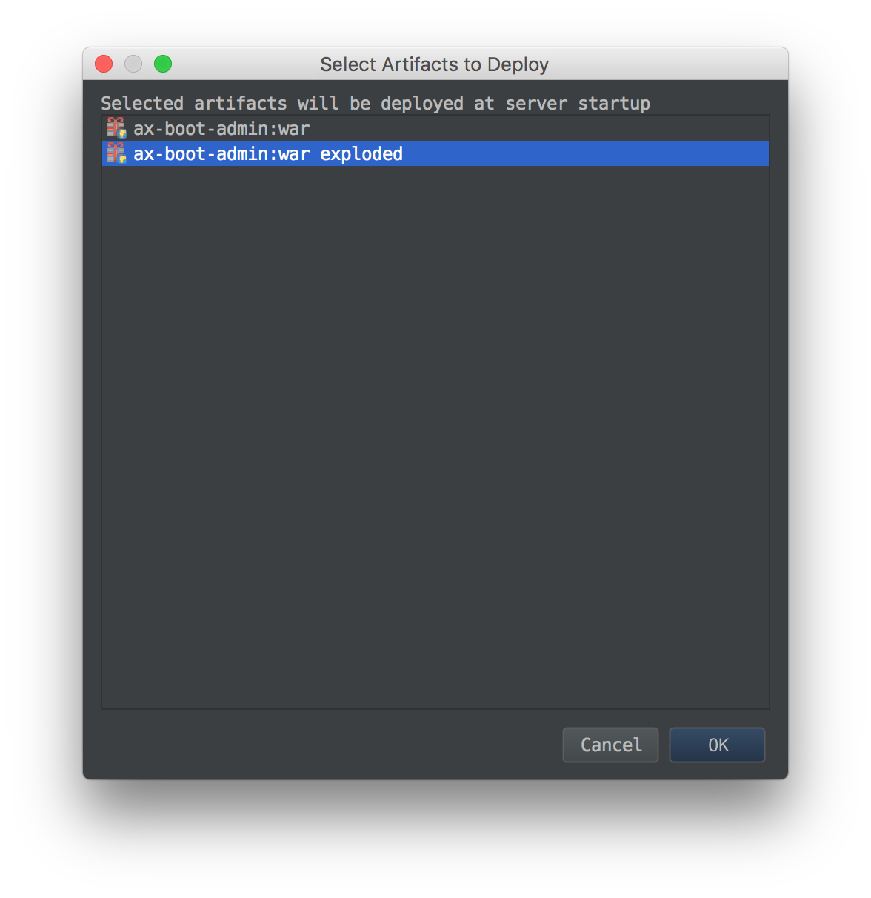
5. Run -> Run 혹은 Debug로 서버를 시작하거나, 메뉴바에 있는 Run/Debug 아이콘으로 서버를 시작합니다.
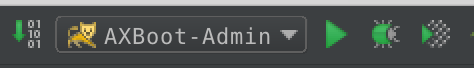

## AXBoot 데이터베이스 스키마 초기화 하기
1. AXBoot를 최초 실행시 다음과 같은 스키마 초기화 화면으로 이동하게 됩니다.
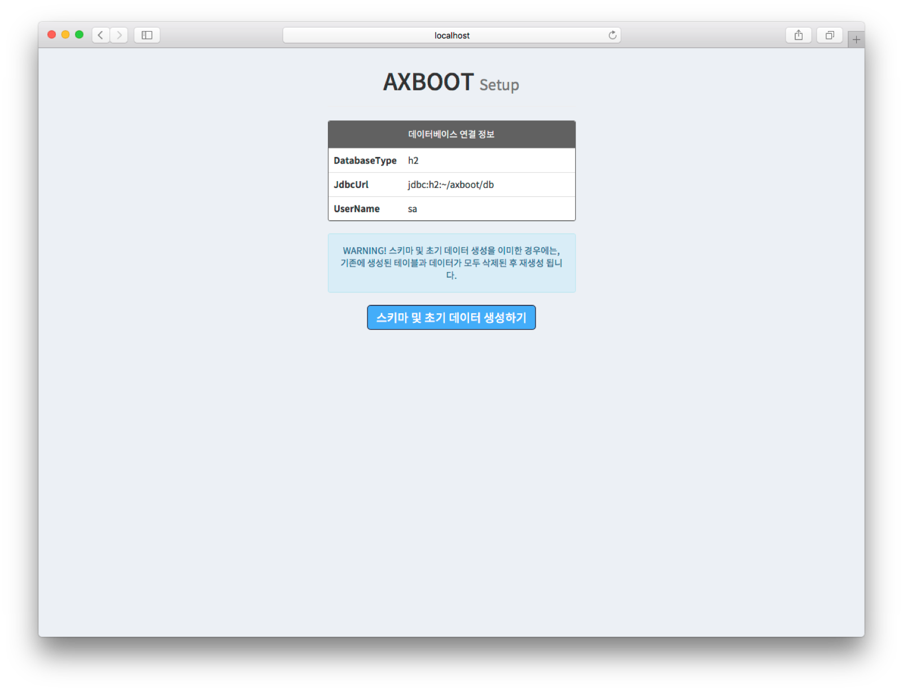
2. 스키마 및 초기 데이터 생성하기 버튼을 클릭하면, 해당 데이터베이스에 맞는 DDL이 생성되고, 로그인 및 초기 메뉴 구성을 위한 데이터 구성 됩니다.
3. 추후 스키마나 데이터를 초기화 하고싶을 경우에는 http://{host}:{port}/setup 으로 접속할 수 있습니다.